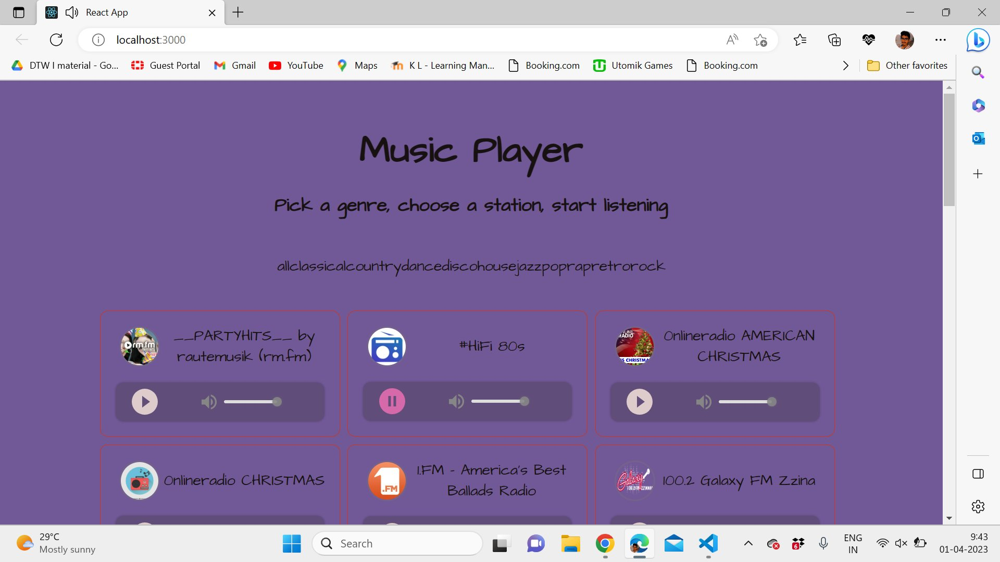
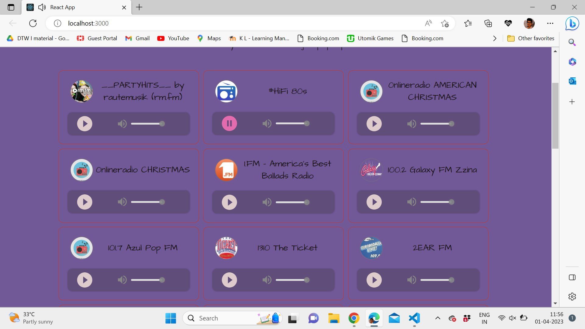
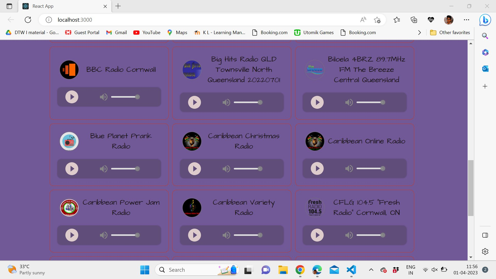

# 🎵 React Music Player

<p align="center">
  
</p>

<p align="center">
  A beautiful, responsive HTML5 music player component for React
</p>

<p align="center">
  
  
  
  
</p>

---

## 📸 Screenshots

> Mini Mode


> Home Screen


> Genre Selection


> Station List 1


> Station List 2


---

## ✨ Features

- ✅ Beautiful UI and smooth animations
- ✅ Fully responsive (desktop & mobile)
- ✅ Light / Dark / Auto theme support
- ✅ TypeScript support (d.ts included)
- ✅ Lyrics display support
- ✅ Drag and sort audio list
- ✅ Full and Mini player modes
- ✅ Glass background effect
- ✅ Media session support
- ✅ Internationalization (English )
- ✅ Custom player icons
- ✅ Audio volume fade in / fade out
- ✅ Server-Side Rendering (SSR) support
- ✅ Import directly in browser

---

## 📦 Installation

Using **yarn**:
```bash
yarn add react-jinke-music-player
```

Using **npm**:
```bash
npm install react-jinke-music-player --save
```

---

## 🚀 Quick Start

```jsx
import React from 'react'
import ReactDOM from 'react-dom'
import ReactJkMusicPlayer from 'react-jinke-music-player'
import 'react-jinke-music-player/assets/index.css'

const options = {
  audioLists: [
    {
      name: 'Your Song Title',
      singer: 'Artist Name',
      cover: 'cover-image-url.jpg',
      musicSrc: 'your-audio-file.mp3',
    },
  ],
  theme: 'dark',
  locale: 'en_US',
  autoPlay: false,
}

ReactDOM.render(
  <ReactJkMusicPlayer {...options} />,
  document.getElementById('root'),
)
```

---

## 🌐 Live Demo

👉 [https://lijinke666.github.io/react-music-player/](https://lijinke666.github.io/react-music-player/)

---

## ⚙️ API Options

| Name | Type | Default | Description |
| ---- | ---- | ------- | ----------- |
| audioLists | `Array` | `-` | List of audio tracks |
| theme | `light` \| `dark` \| `auto` | `dark` | Player theme |
| locale | `en_US` \| `zh_CN` | `en_US` | Player language |
| mode | `mini` \| `full` | `mini` | Player display mode |
| autoPlay | `Boolean` | `true` | Auto play on load |
| defaultVolume | `Number` | `1` | Default volume (0 to 1) |
| showDownload | `Boolean` | `true` | Show download button |
| showPlay | `Boolean` | `true` | Show play button |
| showReload | `Boolean` | `true` | Show reload button |
| showPlayMode | `Boolean` | `true` | Show play mode button |
| showThemeSwitch | `Boolean` | `true` | Show theme switch |
| showLyric | `Boolean` | `false` | Show lyrics button |
| showDestroy | `Boolean` | `false` | Show destroy button |
| drag | `Boolean` | `true` | Enable drag in mini mode |
| seeked | `Boolean` | `true` | Enable progress bar seeking |
| glassBg | `Boolean` | `false` | Glass background effect |
| remember | `Boolean` | `false` | Remember last player state |
| remove | `Boolean` | `true` | Allow removing audio |
| spaceBar | `Boolean` | `false` | Play/pause with spacebar |
| responsive | `Boolean` | `true` | Responsive mode |
| toggleMode | `Boolean` | `true` | Allow switching mini/full mode |
| showMiniModeCover | `Boolean` | `true` | Show cover in mini mode |
| showMiniProcessBar | `Boolean` | `false` | Show progress bar in mini mode |
| preload | `Boolean` \| `String` | `false` | Preload audio |
| defaultPlayMode | `String` | `order` | Default play mode |
| volumeFade | `Object` | `-` | Fade in/out duration (ms) |

---

## 🎮 Play Modes

| Mode | Description |
| ---- | ----------- |
| `order` | Play in order |
| `orderLoop` | Loop the playlist |
| `singleLoop` | Loop single track |
| `shufflePlay` | Shuffle play |

---

## 📡 Event Callbacks

| Event | Description |
| ----- | ----------- |
| `onAudioPlay` | Triggered when audio plays |
| `onAudioPause` | Triggered when audio pauses |
| `onAudioEnded` | Triggered when audio ends |
| `onAudioError` | Triggered on audio error |
| `onAudioProgress` | Triggered on audio progress |
| `onAudioSeeked` | Triggered when user seeks |
| `onAudioVolumeChange` | Triggered on volume change |
| `onThemeChange` | Triggered on theme change |
| `onModeChange` | Triggered on mode change |
| `onPlayModeChange` | Triggered on play mode change |
| `onAudioListsChange` | Triggered when audio list changes |
| `onDestroyed` | Triggered when player is destroyed |

---

## 🛠️ Development

```bash
# Clone the repository
git clone https://github.com/your-username/react-music-player.git

# Install dependencies
yarn install

# Start development server
yarn demo

# Open in browser
# http://localhost:8084/
```

---

## 🧪 Run Tests

```bash
npm run test
```

---

## 📁 Project Structure

```
react-music-player/
├── src/              # Source code
│   ├── components/   # React components
│   ├── config/       # Configuration files
│   ├── locale/       # Language files (en_US, zh_CN)
│   ├── styles/       # CSS / Less styles
│   └── index.js      # Main entry point
├── example/          # Demo application
├── __tests__/        # Test files
├── assets/           # Built CSS assets
└── README.md         # Documentation
```

---


